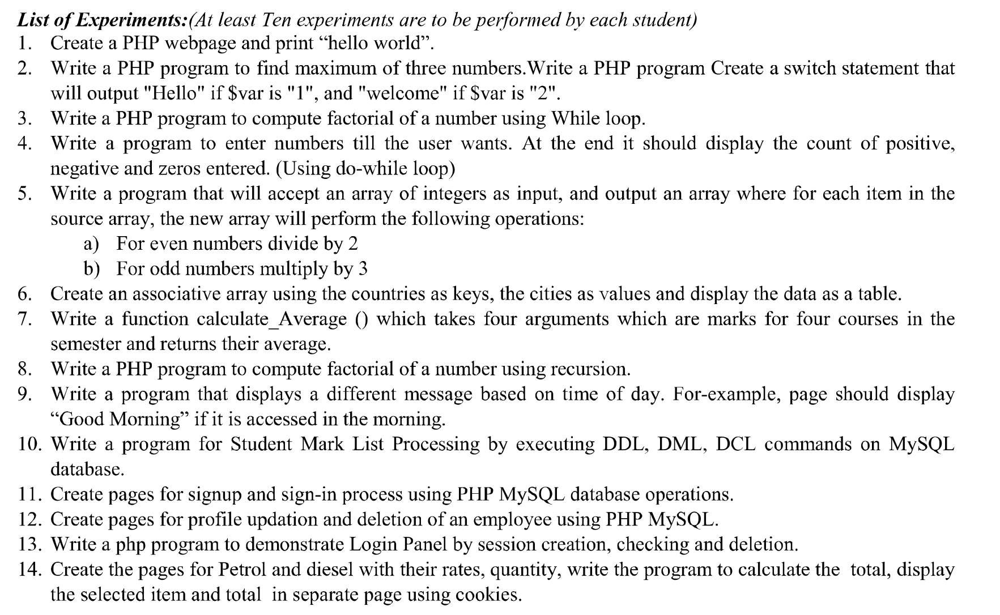

# PHP LAB

for the sake of college, semester 4.

## How to run:

START:

```
sudo /opt/lampp/lampp start
```

STOP:

```
sudo /opt/lampp/lampp stop
```

- Clone repo to `htdocs` folder.
- OPEN `localhost/php-lab/exp$n` to run

By default on Linux, `htdocs` folder is not writeable. Give permissions safely with:

RUN `whoami` and replace `user` in the next command:

```
sudo chown -R user:user /opt/lampp/htdocs
```

#### Online Compiler:

some stuff doesn't work on XAMPP, e.g. `readline()`, so find alternatives to do it via XAMPP. Best online compiler: [good compiler <3](https://www.tutorialspoint.com/execute_php_online.php)

### Uninstalling after semester ends coz I don't want XAMPP:

```
cd /opt/lampp
sudo ./uninstall
sudo rm -r /opt/lampp
```

## Experiments:



## Programs I wrote in file:

- wap print "hello"
- wap prime numbers till 50
- wap greatest of 3 nums with switch-case
- wap factorial using recursion
- wap factorial using while
- wap calc_avg() for 4 subjects marks
- 7
- 8
- 9
- 10
